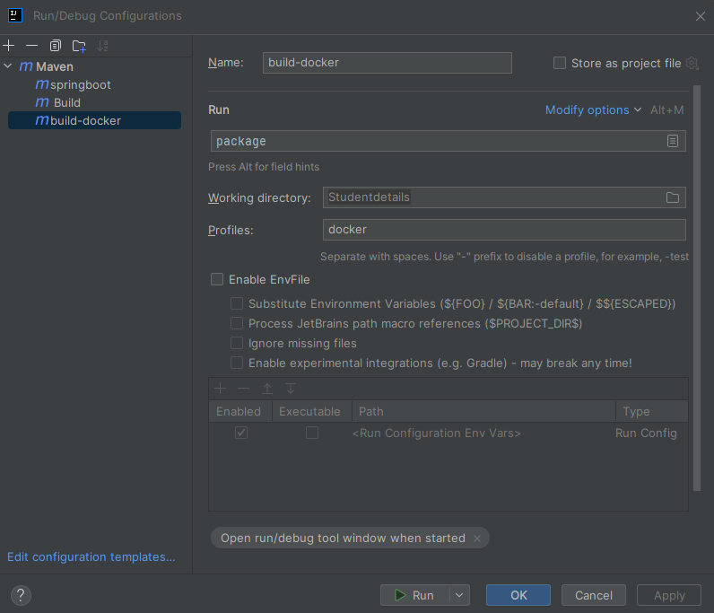
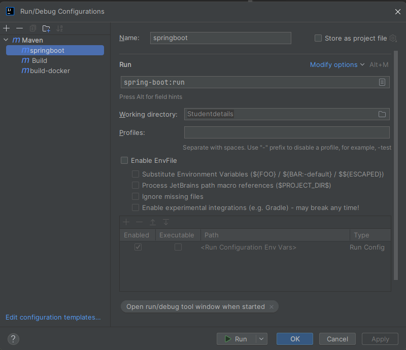

# Student Details - Spring Boot Application

A beginner-friendly Spring Boot application demonstrating REST API development, database integration, and deployment with Docker and Kubernetes.

---

## What you'll learn

- Building and running Spring Boot applications with Maven
- Creating REST APIs to manage student records
- Deploying applications using Docker containers
- Running applications on Kubernetes clusters
- Database management with H2 and Liquibase migrations

---

## Application Overview

- **Application Name:** studentdetails
- **Port:** 8081 (default)
- **Database:** H2 in-memory database
- **API Endpoint:** `POST /api/students` (creates student records)
- **Tech Stack:** Spring Boot, Maven, H2 Database, Liquibase

---

## Project Structure

```
src/main/java/com/gnyra/
├── StudentDetailsApplication.java    # Main Spring Boot application
├── controller/
│   ├── StudentController.java        # REST API endpoints (v1)
│   └── StudentControllerV2.java      # REST API endpoints (v2)
├── dto/
│   └── Student.java                  # Student data transfer object
├── entity/
│   └── StudentEntity.java            # JPA entity for database
├── repository/
│   ├── StudentHashMapDB.java         # In-memory storage (v1)
│   └── StudentJpaRepository.java     # JPA repository (v2)
└── service/
    ├── StudentServiceV1.java         # Business logic (v1)
    └── StudentServiceV2.java         # Business logic (v2)

src/main/resources/
├── application.properties            # Application configuration
└── db/changelog/                     # Liquibase database migrations
```

---

---

## Getting Started

### Prerequisites

- Java 17 or higher
- Maven (or use the included Maven wrapper)
- Docker (optional, for containerization)
- Kubernetes cluster (optional, for K8s deployment)

---

## Option 1: Run with Maven

### Build the project

Navigate to the project directory and build using the Maven wrapper:

```powershell
cd C:\Sudha_Projects\Studentdetails
.\mvnw.cmd -DskipTests package
```

This command:
- Downloads Maven if not already present
- Compiles the source code
- Packages the application into a JAR file (located in `target/`)
- Skips running tests for faster builds

### Run the application

You have two options to run the application:

**Option A: Run the packaged JAR**

```powershell
java -jar target\studentdetails-0.0.1-SNAPSHOT.jar
```

**Option B: Run directly with Spring Boot Maven plugin**

```powershell
.\mvnw.cmd spring-boot:run
```



The application will start on **http://localhost:8081**

### Verify the application is running

```powershell
# Check if the application port is listening (Windows)
netstat -ano | findstr :8081

# Or use PowerShell to test the connection
Test-NetConnection -ComputerName localhost -Port 8081

# Check if Java process is running
Get-Process | Where-Object {$_.ProcessName -eq "java"}
```

### Test the API

Once the application is running, you can create student records using the REST API.

**Using curl:**

```bash
curl -X POST "http://localhost:8081/api/students" -H "Content-Type: application/json" -d '{"name":"Alice","age":21}'
```

**Using PowerShell:**

```powershell
# Create a student using PowerShell
$body = @{
    name = "Alice"
    age = 21
} | ConvertTo-Json

Invoke-RestMethod -Uri "http://localhost:8081/api/students" -Method POST -Body $body -ContentType "application/json"

# Get all students (if GET endpoint exists)
Invoke-RestMethod -Uri "http://localhost:8081/api/students" -Method GET
```

**Expected response:**

The API will return the created student object with an auto-generated `id`.

### Additional Maven Commands

Here are useful Maven commands for development:

```powershell
# Clean and rebuild the project
.\mvnw.cmd clean package

# Run tests
.\mvnw.cmd test

# Clean the target directory
.\mvnw.cmd clean

# Compile without packaging
.\mvnw.cmd compile

# Install to local Maven repository
.\mvnw.cmd clean install

# Check for dependency updates
.\mvnw.cmd versions:display-dependency-updates

# Show dependency tree
.\mvnw.cmd dependency:tree

# Run with a specific profile
.\mvnw.cmd spring-boot:run -Pdev
```

---

## Option 2: Run with Docker

Docker allows you to run the application in an isolated container without installing Java on your machine.

### Quick Start with Pre-built Image

If you have a Docker image available, run it directly:

```powershell
docker run -d -p 8081:8081 --name studentdetails ponnagantisuji/studentdetails:0.0.1-SNAPSHOT
```

This command:
- `-d` runs the container in detached mode (background)
- `-p 8081:8081` maps port 8081 from container to host
- `--name studentdetails` gives the container a friendly name

### Build Your Own Docker Image

Build the Docker image from the provided Dockerfile:

```powershell
cd C:\Sudha_Projects\Studentdetails
docker build -t studentdetails:local .
```


### Tag and Push to Docker Hub

Tag the image for your Docker Hub registry:

```powershell
# Tag it for your registry namespace
docker tag studentdetails:local ponnagantisuji/studentdetails:0.0.1-SNAPSHOT

# Login to Docker Hub (required before pushing)
docker login

# Push to Docker Hub
docker push ponnagantisuji/studentdetails:0.0.1-SNAPSHOT
```

### Load Image from Tarball

If you have a pre-built image as a tarball file:

```powershell
PS C:\Suji_Workspace\studentdetails> docker image ls
REPOSITORY   TAG       IMAGE ID   CREATED   SIZE

PS C:\Suji_Workspace\studentdetails> docker load -i .\studentdetails-0.0.1-SNAPSHOT.tar
Loaded image: ponnagantisuji/studentdetails:0.0.1-SNAPSHOT

PS C:\Suji_Workspace\studentdetails> docker image ls
REPOSITORY                      TAG              IMAGE ID       CREATED        SIZE
ponnagantisuji/studentdetails   0.0.1-SNAPSHOT   0fb9e1d105c4   55 years ago   411MB
```

### Save Image to Tarball

To distribute the image without a registry:

```powershell
docker save ponnagantisuji/studentdetails:0.0.1-SNAPSHOT -o studentdetails-0.0.1-SNAPSHOT.tar
```

### Manage Docker Containers

**Restart the container:**

```powershell
docker stop studentdetails
docker rm studentdetails
docker run -d -p 8081:8081 --name studentdetails ponnagantisuji/studentdetails:0.0.1-SNAPSHOT
docker ps
docker logs studentdetails
```

**Inspect and debug:**

```powershell
# View container details
docker inspect studentdetails

# Check container status
docker ps -a

# Follow live logs
docker logs -f studentdetails

# Execute commands inside container
docker exec -it studentdetails sh

# Check resource usage
docker stats studentdetails
```

### Test the API in Docker

Once the container is running, test the API:

```powershell
# Using curl
curl -X POST "http://localhost:8081/api/students" -H "Content-Type: application/json" -d '{\"name\":\"Bob\",\"age\":22}'

# Using PowerShell
Invoke-WebRequest -Uri "http://localhost:8081/api/students" -Method POST -Headers @{"Content-Type"="application/json"} -Body '{"name":"Charlie","age":23}'
```

### Clean Up Docker Resources

```powershell
# Remove container
docker rm -f studentdetails

# Remove image
docker rmi ponnagantisuji/studentdetails:0.0.1-SNAPSHOT

# Remove all stopped containers
docker container prune

# Remove all unused images
docker image prune -a
```

---

## Option 3: Deploy to Kubernetes

Kubernetes provides orchestration for containerized applications with features like scaling, load balancing, and self-healing.

### Prerequisites

- Kubernetes cluster (Docker Desktop, Minikube, or cloud provider)
- kubectl CLI tool configured

### Check Your Kubernetes Cluster

```powershell
PS C:\Suji_Workspace\studentdetails> kubectl config get-clusters
NAME
docker-desktop

PS C:\Suji_Workspace\studentdetails> kubectl config get-contexts
CURRENT   NAME             CLUSTER          AUTHINFO         NAMESPACE
*         docker-desktop   docker-desktop   docker-desktop
```

### Deploy the Application

The repository includes a Kubernetes manifest file (`kube/studentdetails.yaml`) that defines:
- **Namespace:** suji-ns (isolated environment)
- **Deployment:** 2 replicas of the application
- **Service:** NodePort service exposing port 8081

**Apply the configuration:**

```powershell
PS C:\Suji_Workspace\studentdetails\kube> kubectl apply -f studentdetails.yaml
namespace/suji-ns created
deployment.apps/studentdetails-deployment created
service/studentdetails-service created
```

### Verify the Deployment

**Check pods:**

```powershell
PS C:\Suji_Workspace\studentdetails\kube> kubectl get pods -n suji-ns
NAME                                         READY   STATUS    RESTARTS   AGE
studentdetails-deployment-6989dc9dbc-kjjsk   1/1     Running   0          13s
studentdetails-deployment-6989dc9dbc-nm2nt   1/1     Running   0          13s
```

**Check service:**

```powershell
PS C:\Suji_Workspace\studentdetails\kube> kubectl get svc -n suji-ns
NAME                     TYPE       CLUSTER-IP      EXTERNAL-IP   PORT(S)          AGE
studentdetails-service   NodePort   10.96.174.125   <none>        8081:30081/TCP   13s
```

**Check nodes:**

```powershell
PS C:\Suji_Workspace\studentdetails\kube> kubectl get nodes -o wide
NAME                    STATUS   ROLES           AGE   VERSION   INTERNAL-IP   EXTERNAL-IP   OS-IMAGE                         KERNEL-VERSION                     CONTAINER-RUNTIME
desktop-control-plane   Ready    control-plane   13m   v1.31.1   172.18.0.2    <none>        Debian GNU/Linux 12 (bookworm)   6.6.87.2-microsoft-standard-WSL2   containerd://1.7.18
```

### Set Default Namespace (Optional)

To avoid typing `-n suji-ns` with every command:

```powershell
PS C:\Suji_Workspace\studentdetails\kube> kubectl config set-context --current --namespace=suji-ns
Context "docker-desktop" modified.

PS C:\Suji_Workspace\studentdetails\kube> kubectl get pods
NAME                                         READY   STATUS    RESTARTS   AGE
studentdetails-deployment-6989dc9dbc-kjjsk   1/1     Running   0          2m11s
studentdetails-deployment-6989dc9dbc-nm2nt   1/1     Running   0          2m11s
```

### Access the Application

**Option 1: Port forward the service**

```powershell
kubectl port-forward svc/studentdetails-service 8081:8081 -n suji-ns
```

Keep this terminal window open while using the application.

**Option 2: Port forward to a specific pod**

```powershell
# Get pod name
kubectl get pods -n suji-ns

# Port forward to the pod
kubectl port-forward studentdetails-deployment-6989dc9dbc-kjjsk 8081:8081 -n suji-ns
```

**Option 3: Access via NodePort**

The service is exposed on NodePort 30081. Access it at:
- `http://localhost:30081/api/students`

### Test the API in Kubernetes

After setting up port forwarding, test the API in a new terminal:

```powershell
# Via port-forward (localhost:8081)
curl -X POST "http://localhost:8081/api/students" -H "Content-Type: application/json" -d '{\"name\":\"Dave\",\"age\":24}'

# Via NodePort (localhost:30081)
curl -X POST "http://localhost:30081/api/students" -H "Content-Type: application/json" -d '{\"name\":\"Eve\",\"age\":25}'
```

### View Logs

```powershell
# View logs from a specific pod
kubectl logs -f studentdetails-deployment-6989dc9dbc-kjjsk -n suji-ns

# View logs from all pods in the deployment
kubectl logs -l app=studentdetails -n suji-ns

# View logs with timestamps
kubectl logs <pod-name> -n suji-ns --timestamps
```

### Debugging Commands

```powershell
# Describe deployment (shows configuration and events)
kubectl describe deployment studentdetails-deployment -n suji-ns

# Describe pod (shows status and troubleshooting info)
kubectl describe pod <pod-name> -n suji-ns

# Execute commands inside a pod
kubectl exec -it <pod-name> -n suji-ns -- sh

# Check resource usage
kubectl top pods -n suji-ns
kubectl top nodes

# View all resources in the namespace
kubectl get all -n suji-ns
kubectl get all -n suji-ns -o wide
```

### Scaling the Application

```powershell
# Scale up to 3 replicas
kubectl scale deployment studentdetails-deployment --replicas=3 -n suji-ns

# Scale down to 1 replica
kubectl scale deployment studentdetails-deployment --replicas=1 -n suji-ns

# Verify scaling
kubectl get pods -n suji-ns
```



### Rolling Updates and Rollbacks

```powershell
# Update to a new image version
kubectl set image deployment/studentdetails-deployment studentdetails=ponnagantisuji/studentdetails:0.0.2-SNAPSHOT -n suji-ns

# Check rollout status
kubectl rollout status deployment/studentdetails-deployment -n suji-ns

# View rollout history
kubectl rollout history deployment/studentdetails-deployment -n suji-ns

# Rollback to previous version
kubectl rollout undo deployment/studentdetails-deployment -n suji-ns
```

### Clean Up Kubernetes Resources

```powershell
# Delete specific resources
kubectl delete pod <pod-name> -n suji-ns
kubectl delete svc studentdetails-service -n suji-ns
kubectl delete deployment studentdetails-deployment -n suji-ns

# Delete everything defined in the YAML
kubectl delete -f studentdetails.yaml

# Delete the entire namespace
kubectl delete namespace suji-ns

# Force delete a stuck pod
kubectl delete pod <pod-name> -n suji-ns --grace-period=0 --force

# Reset to default namespace
kubectl config set-context --current --namespace=default
```

---

## Database Management

### H2 Database Console

The application includes an H2 web console for inspecting the in-memory database during development.

**Access the console:**

Open in your browser: **http://localhost:8081/h2-console**

**Connection settings:**

```
Driver Class: org.h2.Driver
JDBC URL:     jdbc:h2:mem:studentdb
User Name:    sa
Password:     (leave empty)
```

**Important notes:**

- The application uses an **in-memory** database. Data is lost when the application stops.
- The JDBC URL must be `jdbc:h2:mem:studentdb` to connect to the same database instance as the application.
- **Do NOT use** `jdbc:h2:~/studentdb` or file-based URLs - they will create a separate database file.

**Accessing H2 console in Docker/Kubernetes:**

- **Docker:** Ensure port 8081 is exposed with `-p 8081:8081`
- **Kubernetes:** Use `kubectl port-forward svc/studentdetails-service 8081:8081 -n suji-ns`

**Useful SQL queries:**

```sql
-- Check Liquibase migration history
SELECT ID, AUTHOR, FILENAME, DATEEXECUTED FROM DATABASECHANGELOG;

-- View student records
SELECT * FROM STUDENT;
```

### Liquibase Database Migrations

Liquibase automatically manages database schema changes when the application starts.

**Configuration location:**

```
src/main/resources/db/changelog/
├── db.changelog-master.xml          # Master changelog
└── changes/
    └── 001-create-student-table.xml # Initial table creation
```

**How it works:**

1. Spring Boot starts and Liquibase runs automatically (`spring.liquibase.enabled=true`)
2. Liquibase reads `db/changelog/db.changelog-master.xml`
3. Applies any unapplied changesets to the database
4. Records applied changes in the `DATABASECHANGELOG` table

**Using a persistent database:**

To keep data between application restarts, change the JDBC URL in `src/main/resources/application.properties`:

```properties
# File-based H2 database (data persists on disk)
spring.datasource.url=jdbc:h2:file:~/studentdb;DB_CLOSE_ON_EXIT=FALSE;AUTO_SERVER=TRUE
```

**Note:** When using a file-based database, update the H2 console JDBC URL to match.

---

## Troubleshooting

### Common Issues and Solutions

**Problem:** H2 Console shows "Database not found" error

- **Cause:** Using a file-based JDBC URL while the app uses in-memory database
- **Solution:** Use `jdbc:h2:mem:studentdb` in the H2 console login

**Problem:** Liquibase didn't create the STUDENT table

- **Check:** `spring.liquibase.enabled=true` in `application.properties`
- **Check:** `spring.liquibase.change-log=classpath:db/changelog/db.changelog-master.xml`
- **View:** Application startup logs for Liquibase errors

**Problem:** Cannot access application in Docker

- **Solution:** Ensure port mapping with `-p 8081:8081`
- **Check:** Container is running with `docker ps`
- **View logs:** `docker logs studentdetails`

**Problem:** Cannot access application in Kubernetes

- **Solution:** Use `kubectl port-forward svc/studentdetails-service 8081:8081 -n suji-ns`
- **Or:** Access via NodePort at `http://localhost:30081`
- **Check pods:** `kubectl get pods -n suji-ns`
- **View logs:** `kubectl logs <pod-name> -n suji-ns`

**Problem:** Port 8081 is already in use

- **Check:** `netstat -ano | findstr :8081`
- **Solution:** Stop the process using the port or change the application port in `application.properties`

---

## Next Steps

**For Development:**
- Add new Liquibase changesets in `src/main/resources/db/changelog/changes/`
- Include new changesets in `db.changelog-master.xml`
- Implement additional REST endpoints (GET, PUT, DELETE)
- Add data validation and error handling

**For Production:**
- Switch to a production database (PostgreSQL, MySQL)
- Disable H2 console (`spring.h2.console.enabled=false`)
- Configure external configuration management
- Set up monitoring and logging
- Implement security (authentication, authorization)
- Configure SSL/TLS certificates

---

## Quick Reference

**Application URL:** http://localhost:8081

**API Endpoints:**
- `POST /api/students` - Create a new student

**H2 Console:** http://localhost:8081/h2-console

**JDBC URL:** jdbc:h2:mem:studentdb

**Useful Commands:**
```powershell
# Run locally
.\mvnw.cmd spring-boot:run

# Run with Docker
docker run -d -p 8081:8081 --name studentdetails ponnagantisuji/studentdetails:0.0.1-SNAPSHOT

# Deploy to Kubernetes
kubectl apply -f kube/studentdetails.yaml

# Port forward in Kubernetes
kubectl port-forward svc/studentdetails-service 8081:8081 -n suji-ns
```

---
---------------------------
adding
